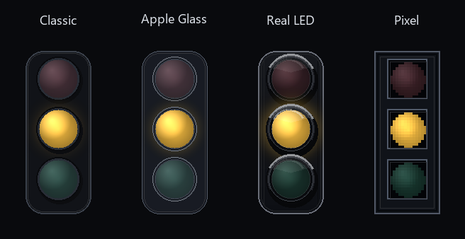
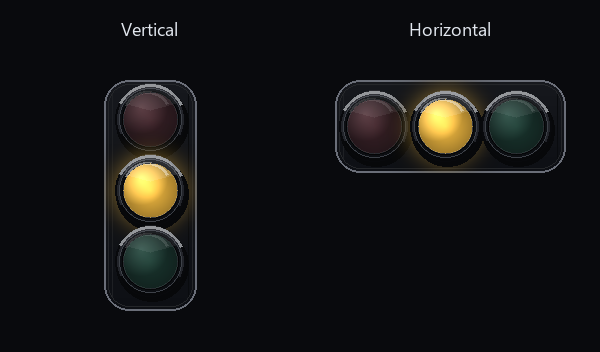
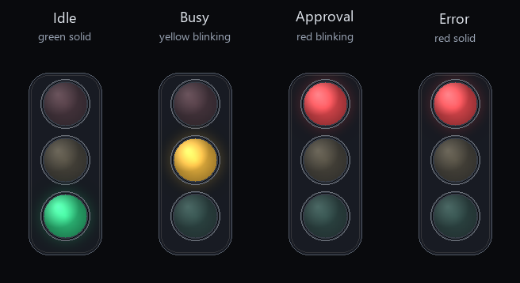

# CC LED

[English](README.md)

CC LED 是一个面向 Claude Code 和 Codex 的 hook 事件驱动桌面状态灯。它会显示一个置顶、可拖动的红绿灯悬浮窗，同时也提供托盘图标，让你快速看到 AI 助手当前是在工作、等待审批、已经完成，还是出现错误。

这个项目的灵感来自 Clawd on Desk，但 CC LED 把核心状态逻辑保持在本地且轻量：Claude/Codex hooks 将生命周期事件发送到本地 HTTP 服务，状态归并器聚合所有会话，然后更新悬浮灯和托盘图标。

## 状态规则

悬浮灯默认从上到下有三个圆形灯：

| 灯 | 含义 | 行为 |
| --- | --- | --- |
| 红灯 | 审批、需要用户注意，或错误 | 审批/注意时闪烁；错误时常亮 |
| 黄灯 | Claude 或 Codex 正在工作 | 以稳定的 1 Hz 节奏闪烁 |
| 绿灯 | 完成 / 空闲 | 常亮 |

典型事件映射：

| 事件 | 状态 |
| --- | --- |
| `SessionStart`, `SessionEnd`, `Stop` | 空闲 / 绿灯 |
| `UserPromptSubmit`, `PreToolUse`, `PostToolUse`, `SubagentStart`, `SubagentStop`, `PreCompact`, 自动 `PostCompact` | 工作中 / 黄灯 |
| `PermissionRequest`, `Elicitation` | 审批 / 红灯闪烁 |
| `Notification`, 类似问题的 `Stop` 输出 | 短暂用户提醒 / 红灯 |
| `PostToolUseFailure`, `StopFailure`, API error | 错误 / 红灯常亮 |

真实审批事件会使用更长的超时时间，因此在你审批前红灯会保持可见。短暂提醒会自动回到绿灯。

## 界面

主界面是一个置顶的悬浮红绿灯：

- 按住鼠标左键拖动
- 使用鼠标滚轮调整大小
- 右键切换视觉效果、横向/竖向布局、大小、透明度、hook 安装，或退出
- 双击在绿灯/黄灯/红灯之间循环，用于快速视觉测试

目前有四种悬浮灯效果：

- `Classic`：深色圆角交通灯外观
- `Apple Glass`：中性深色玻璃胶囊，带柔和内部光晕
- `Real LED`：深色底座、金属灯圈、带高光的 LED 镜片
- `Pixel`：矩形像素风框架和块状灯珠

审批和完成会播放短促的自定义 WAV 提示音，生成位置为 `%APPDATA%\CC LED\sounds`。CC LED 不调用 Windows 系统提示音。

内置声音预设位于 `cc_led/assets/sounds/`。用户选择的声音设置保存在 `%APPDATA%\CC LED\sound_settings.json`。

## 图片说明

README 预览图展示三件事：视觉效果、布局方向、以及不同状态下亮起的 LED。图片资源位于 `docs/images/`。

### 四种效果

下面的对比图把四种效果放在一起，并统一使用 `busy / yellow` 状态，方便观察发光效果：



| 效果 | 图片说明 |
| --- | --- |
| `Classic` | 深色圆角交通灯外壳，灯珠较简洁。黄灯亮起，红灯和绿灯变暗。 |
| `Apple Glass` | 中性深色玻璃胶囊，有柔和内部光晕和细微高光。黄灯亮起。 |
| `Real LED` | 更真实的深色底座、金属灯圈、镜片反光和更强 LED 光晕。黄灯亮起。 |
| `Pixel` | 矩形像素风框架，红/黄/绿三颗灯为块状像素风。黄灯亮起。 |

### 横向与竖向

下面展示同一种效果和状态下的两种布局：



| 布局 | 图片说明 |
| --- | --- |
| `Vertical` | 三颗 LED 从上到下排列：红、黄、绿。这是默认交通灯布局。 |
| `Horizontal` | 三颗 LED 从左到右排列：红、黄、绿。适合放在屏幕顶部或底部，占用高度更小。 |

### 状态展示

下面展示每种状态对应的灯光：



| 状态 | 亮起的灯 | 图片说明 |
| --- | --- | --- |
| `idle` | 绿灯常亮 | 绿灯持续亮起；红灯和黄灯变暗。 |
| `busy` | 黄灯闪烁 | Claude 或 Codex 工作时，黄灯以稳定 1 Hz 节奏闪烁。 |
| `approval` | 红灯闪烁 | 需要审批、提问或用户注意时，红灯闪烁。 |
| `error` | 红灯常亮 | 工具错误、停止失败或 API 错误时，红灯常亮。 |

静态截图只展示闪烁状态中的一帧；实际运行时 `busy` 和 `approval` 都会闪烁。

## 架构

```text
Claude Code / Codex
  -> hook command: python main.py --hook <event>
  -> hook adapter reads stdin JSON
  -> POST http://127.0.0.1:32333/state
  -> SessionStore reducer aggregates sessions
  -> overlay + tray icon update
```

本地接口：

| 接口 | 用途 |
| --- | --- |
| `GET /health` | 当前聚合状态 |
| `POST /state` | hook adapter 状态事件 |
| `POST /permission` | 审批通知接口 |

## 隐私

日志写入：

```text
%APPDATA%\CC LED\cc-led.log
```

日志会记录 hook 摘要、状态变化、安装/卸载结果。它不会保存完整 prompt、完整工具输入或 transcript 内容。

## 安装

```powershell
python -m pip install -r requirements.txt
```

## 运行

```powershell
python main.py
```

这会启动悬浮灯、托盘图标、本地状态服务和健康检查。

打包后的 Windows 版本包含两个可执行文件：

- `CC_LED.exe`：无终端窗口的桌面主程序，手动启动
- `CC_LED_Hook.exe`：Claude/Codex hooks 使用的辅助程序

两个文件需要放在同一个文件夹。使用打包版本运行 `CC_LED.exe --install-hooks` 或 `CC_LED.exe --install-codex-hooks` 时，hook 命令会自动指向 `CC_LED_Hook.exe`。

## Claude Hooks

安装或更新 Claude Code hooks：

```powershell
python main.py --install-hooks
```

只卸载 CC LED 的 Claude hook 配置：

```powershell
python main.py --uninstall-hooks
```

安装器会安全更新 `~/.claude/settings.json`：追加 CC LED hooks、通过标记更新已有 CC LED 条目，并保留其他用户 hook。

## Codex Hooks

安装或更新 Codex hooks：

```powershell
python main.py --install-codex-hooks
```

只卸载 CC LED 的 Codex hook 配置：

```powershell
python main.py --uninstall-codex-hooks
```

Codex 会在会话开始时读取 hook 配置，所以安装或修改 hooks 后，需要新开一个 Codex 窗口/会话才能生效。

## 冒烟测试

先启动应用：

```powershell
python main.py
```

Claude hook 冒烟测试：

```powershell
'{"session_id":"smoke","cwd":"C:\\Projects\\demo"}' | python main.py --hook UserPromptSubmit
```

Codex hook 冒烟测试：

```powershell
'{"hook_event_name":"PreToolUse","session_id":"smoke","tool_name":"shell_command"}' | python main.py --codex-hook PreToolUse
```

直接手动测试状态：

```powershell
python main.py --test-state busy
python main.py --test-state idle
python main.py --test-state error
python main.py --test-state approval
```

查看实时状态：

```powershell
Invoke-RestMethod -Uri http://127.0.0.1:32333/health
```

## 排查问题

如果灯不变色：

1. 确认 CC LED 正在运行：`python main.py`。
2. 移动或修改项目后，重新安装 hooks。
3. 对 Codex 来说，修改 hook 后需要新开 Codex 会话。
4. 运行直接测试：`python main.py --test-state busy`。
5. 查看 `%APPDATA%\CC LED\cc-led.log`。

有用的日志示例：

```text
hook ... source=codex event=UserPromptSubmit state=busy session=... posted=True
state=busy event=UserPromptSubmit sessions=1
```

如果 `posted=False`，说明 hook 运行了，但 CC LED 本地服务不可达。如果没有 hook 日志，说明 Claude/Codex 没有运行 CC LED 的 hook 条目。

## 开发

运行测试：

```powershell
python -m pytest -q
```

构建 Windows 可执行文件：

```powershell
python -B build_pyinstaller.py
```

可执行文件会输出到 `dist/CC_LED.exe`。`dist/` 和 `build/` 已被 git 忽略；发布时建议把 exe 作为 GitHub Release 附件，而不是提交到源码仓库。

项目结构：

```text
CC_LED/
  README.md
  README.zh-CN.md
  requirements.txt
  build_pyinstaller.py
  main.py
  cc_led/
    app.py
    config.py
    events.py
    reducer.py
    server.py
    hook_adapter.py
    installer.py
    codex_installer.py
    health.py
    sound.py
    assets/
      sounds/
        F1TR.wav
    ui/
      effects.py
      icons.py
      overlay.py
      tray.py
  tests/
```
